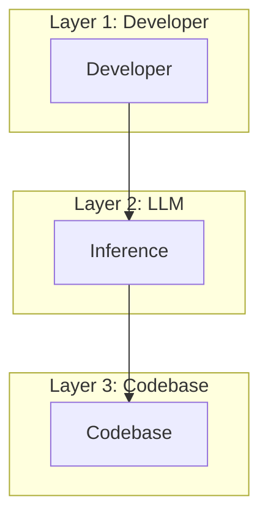
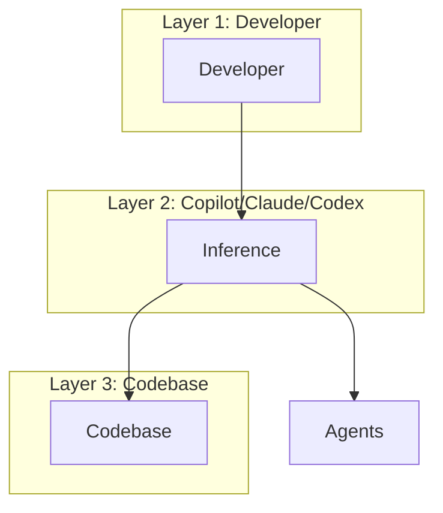
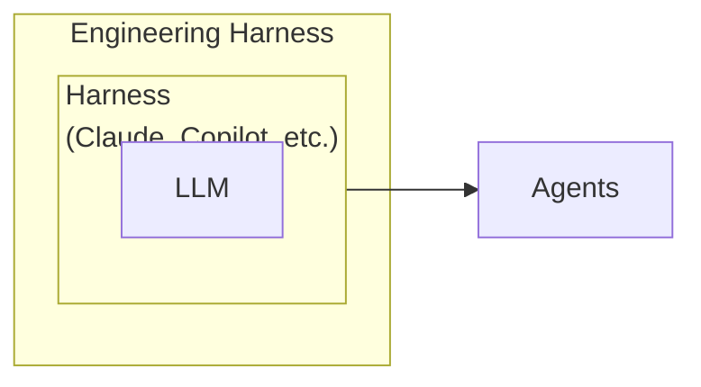

# Challenges

Where we started from

Then here 

Still some common challenges

- The agent takes too long to close the loop.

   `Add a new column for address` - and it's looping for straight 13 minutes.

- Makes random `Tool` calls.

- The agent says `Done`, it's actually `Not`.

- Amnesia Across Sessions.

# What is what?

# Building Blocks

- Real world analogy

Each new session is equavalent of onboarding a new engineer. A new eng. takes a week to setup his dev environment, to run the app on his machine.

Mental test - fire up claude/copilot and ask it to run your app. How many of you think it will be successful? if yes, how long will it take?

- The agent should have clear instructions/tools/skills to boot the app end to end and verify changes. 

# Self-improving Feedback Loop

After each session, there should be a feedback loop to capture what could have been done to improve the harness.