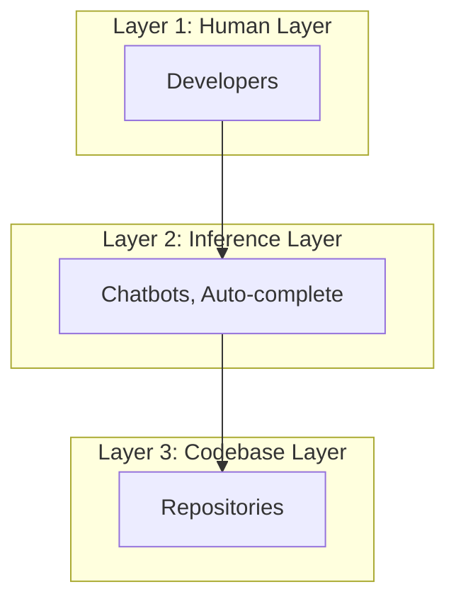
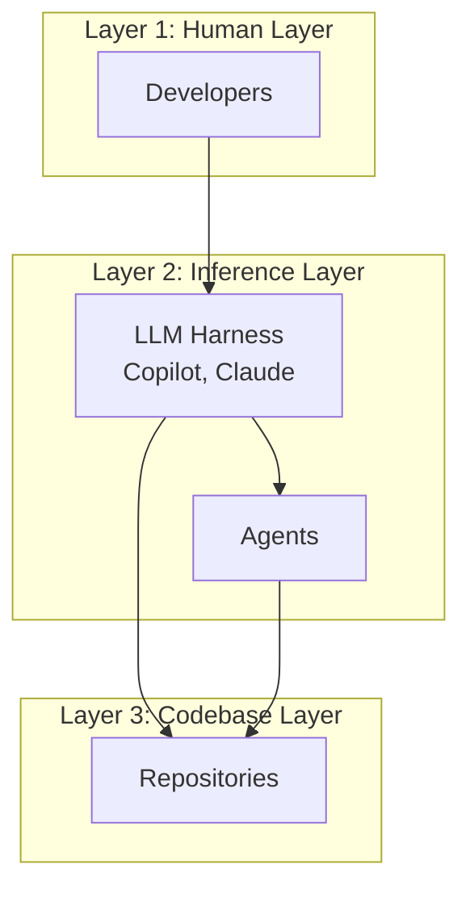
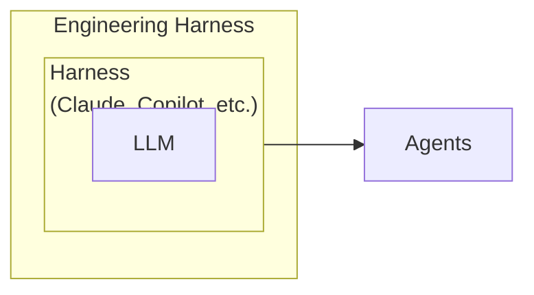
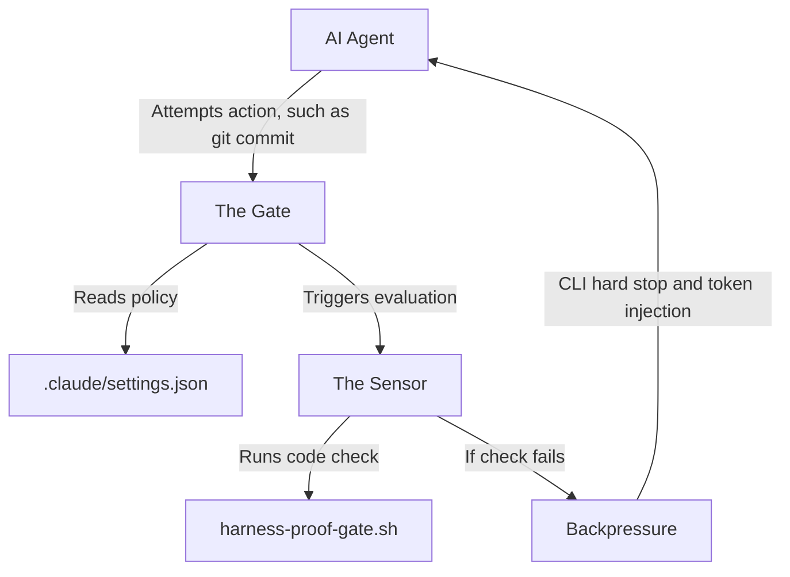

# Minimum Viable Harness

Making legacy codebase agent-ready.

# Only two types of codebase

There are only two kinds of codebases -

- Which makes money - AKA legacy codebase

- Which doesn't make money - AKA greenfield codebase

# We started from here

The early shape: the developer asks, the LLM reasons, and the codebase waits for a human or a tool to make it real.



# Steering the model to run in a loop

Copilot, Claude, Codex, and similar harnesses introduced tool-using agents. The agents can now run in a loop to inspect, edit, run, and verify.



# More agency does not mean more productivity

Sound familiar?

## Long Running Loop

Takes too long to close the loop.

> "Add a new column for address" - and it is looping for straight 13 minutes.


## Dichotomy of tool selection

Random tool calls.

The agent explores because the next useful move is not encoded.


## False Positives

Done does not mean done.

The chat says complete, you click the button and it is broken.


## Onboarding during every session

Amnesia across sessions.

Useful discoveries vanish with the session.


# Cold-start your app with an agent

Ask Copilot, Claude, or Codex to launch it locally - no extra instructions.

## Question 1

Will it succeed from existing repo alone?

## Question 2

If yes, how long until the app is actually running?

How about asking a developer to build a feature without being able to run the code?

# What is what?



## Implementing Backpressure and Gates in Autonomous AI Agents

This guide provides a comprehensive overview of Harness Engineering for autonomous AI coding agents, such as Claude Code. It explains how to prevent autonomous agents from breaking a codebase by separating validation rules into three distinct pillars: Sensors, Gates, and Backpressure.

---

## The Architecture at a Glance

When an autonomous agent operates without a harness, it blindly executes tasks without validation. A proper engineering harness introduces a deterministic safety loop:



---

## The Real-World Scenario

- **The task:** An autonomous agent is told to add a new `phone_number` column to an existing PostgreSQL database and expose it via a FastAPI backend.
- **The mistake:** The agent updates the database files but forgets to add a default value for existing rows in the table. If deployed, this change will instantly crash the production database.

Here is how the three harness components catch, stop, and fix this error automatically.

---

## The Three Core Components

### 1. The Gate: Policy Configuration

The Gate is a strict, conditional rule. It declares when a check must happen and defines the boundary that cannot be crossed. It does not run the tests itself; it acts as the enforcement boundary.

In Claude Code, this is configured natively via a lifecycle hook in `.claude/settings.json`:

```json
{
   "hooks": {
      "PreToolUse": [
         {
            "if": "Bash(git commit*)",
            "run": "./scripts/harness-proof-gate.sh"
         }
      ]
   }
}
```

**Role:** Halts the agent's progress whenever it attempts to commit code, forcing an automated inspection first.

### 2. The Sensor: Data Gatherer

The Sensor is a local script or tool that gathers hard, objective evidence from the project environment. It acts as the system's eyes and ears, returning data to the gate.

This is your local verification script, `./scripts/harness-proof-gate.sh`:

```bash
#!/bin/bash

echo "Running full-stack gate checks..."

# 1. Run a real database migration dry-run.
python -m alembic check
if [ $? -ne 0 ]; then
      echo "INVARIANT_VIOLATION: DATABASE_MIGRATION_FAILED"
      echo "Detail: Your migration file is missing a nullable/default definition."
      exit 2
fi

# 2. Verify backend test suite compilation.
pytest tests/test_backend.py
if [ $? -ne 0 ]; then
      echo "INVARIANT_VIOLATION: BACKEND_COMPILATION_ERROR"
      echo "Detail: FastAPI endpoints returned 500 status on setup."
      exit 2
fi

exit 0
```

**Role:** Evaluates the factual health of the database and backend code, exiting with a specific code, such as `exit 2`, if it finds errors.

### 3. The Backpressure: Friction and Force Layer

Backpressure is the physical resistance the agent experiences when a gate closes. In this ecosystem, the Claude CLI execution engine acts as the backpressure mechanism by executing two mechanical actions after receiving `exit 2`:

1. **The execution brake:** It instantly kills the pending `git commit` process. The agent cannot proceed down its planned execution path.
2. **The token funnel:** It captures the error output from the sensor and pushes it directly into the agent's next memory window, forcing the agent to process the mistake.

The agent's next context window is injected with this payload:

```text
[System Message from PreToolUse Gate]
Tool 'git commit' aborted due to script failure (exit code 2).
Error Category: INVARIANT_VIOLATION: DATABASE_MIGRATION_FAILED
Detail: Your migration file is missing a nullable/default definition.
Fix the code syntax to clear the gate before retrying.
```

---

## Proactive Prevention: The CLAUDE.md Guide

To keep the agent from constantly hitting backpressure loops, you use a `CLAUDE.md` file at the root of your project. This acts as the agent's long-term memory, warning it about where your gates are before it even writes code.

```markdown
# Project Guide: FastAPI + Postgres Backend

## System Invariants and Gates

This project enforces strict execution gates on commits. If you break these, the system harness will reject your tool calls with hard backpressure.

## Database Migration Rules

- Every schema change must have a corresponding Alembic migration script.
- **Critical:** When adding a `NOT NULL` column to an existing table, you must provide a default value, such as `server_default="Unknown"`. Failing to do so triggers the `DATABASE_MIGRATION_FAILED` gate.
```

---

## Summary of Roles

| Component | What it represents | Physical Form in Claude Code |
|---|---|---|
| The Gate | The Policy (The Rule) | .claude/settings.json lifecycle interceptor |
| The Sensor | The Inspector (The Proof) | harness-proof-gate.sh output and exit codes |
| Backpressure | The Friction (The Force) | Claude CLI Engine blocking commands and injecting error tokens into memory |

# Self-improving Feedback Loop

After each session, there should be a feedback loop to capture what could have been done to improve the harness.

# Complexity is spread everywhere

The previous state is chaotic: setup scripts, environment files, migrations, seed data, tests, UI checks, infrastructure, and documentation all live in different places.

A good harness abstracts that spread and gives the agent simple interfaces to interact with the system:

- `boot`
- `seed-db`
- `verify-api`
- `verify-ui`
- `reset`
- `proof`

The agent should work through intent-level handles while the harness owns setup, state, services, and proof.

# A good starting point for legacy codebase

- **Safe execution:** Give agents full CLI access inside an isolated environment, such as a dev container.
- **First-Class System Interfaces:** Expose first-class skills, MCP tools, or CLI commands for GitHub/Azure DevOps, Application Insights, Entra ID, databases, and other architectural components.
- **Intent-level interfaces:** Provide focused commands for projet specific verbs such as `verify-api`, `verify-ui`, and `proof` instead of requiring agents to discover the test strategy.
- **Production visibility:** Give agents read-only access to logs, traces, metrics, and deployment history.
- **Feedback loop:** Capture repeated failures and successful workflows as improvements to the harness.