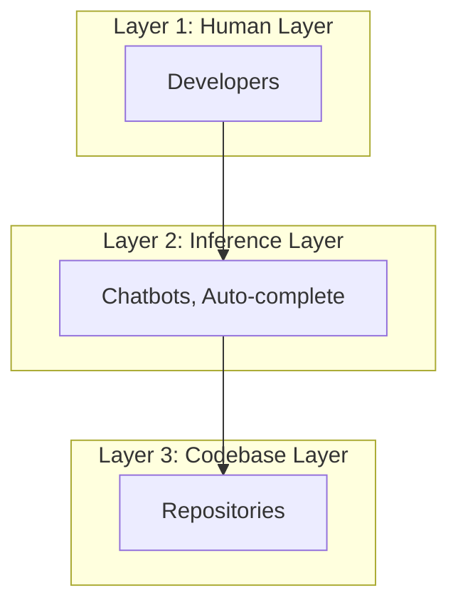
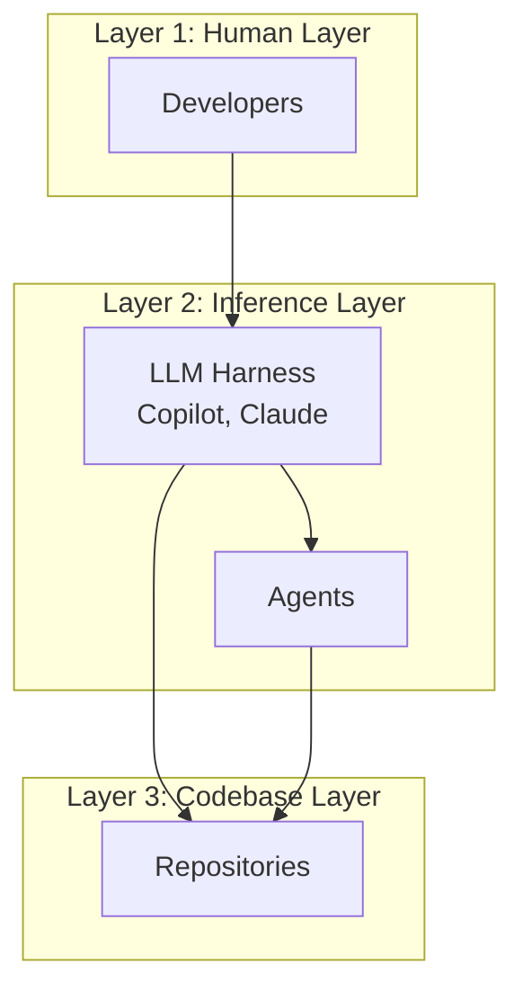
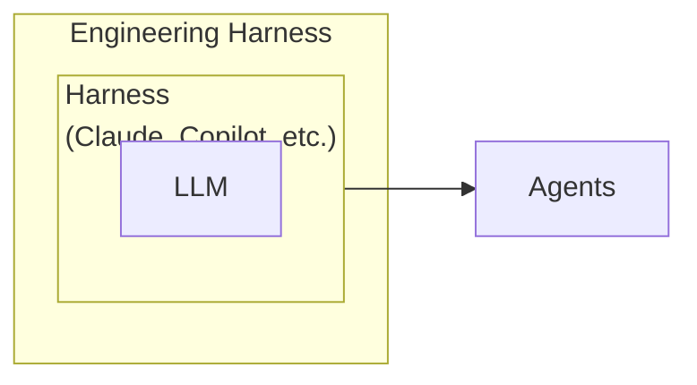

# Minimum Viable Harness

Making development environment agent-ready.

# We started from here

The early shape: the developer asks, the LLM reasons, and the codebase waits for a human or a tool to make it real.

# Steering the model to run in a loop

Copilot, Claude, Codex, and similar harnesses introduced tool-using agents. The agents can now run in a loop to inspect, edit, run, and verify.

# More agency does not mean more productivity

Sound familiar?

## Long Running Loop

Takes too long to close the loop.

> "Add a new column for address" - and it is looping for straight 13 minutes.

## Dichotomy of tool selection

Random tool calls.

The agent explores because the next useful move is not encoded.

## False Positives

Done does not mean done.

The chat says complete, you click the button and it is broken.

## Onboarding during every session

Amnesia across sessions.

Useful discoveries vanish with the session.

# Cold-start your app with an agent

Ask Copilot, Claude, or Codex to launch it locally - no extra instructions.

## Question 1

Will it succeed from existing repo alone?

## Question 2

If yes, how long until the app is actually running?

How about asking a developer to build a feature without being able to run the code?

# What is what?

# Building Blocks

- Real world analogy

Each new session is equavalent of onboarding a new engineer. A new eng. takes a week to setup his dev environment, to run the app on his machine.

- The agent should have clear instructions/tools/skills to boot the app end to end and verify changes. 

# Self-improving Feedback Loop

After each session, there should be a feedback loop to capture what could have been done to improve the harness.